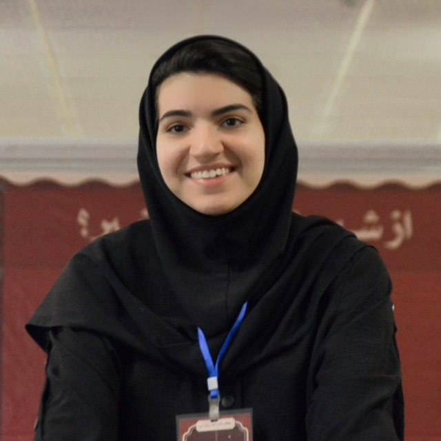

# Welcome

Welcome to Fall 2025 offering of Deep Generative Models course at Sharif University of Technology! We are excited to have you join us on this journey into the world of Deep Generative Models.

## Course Description

This course provides an in-depth introduction to the field of Deep Generative Models. Initially, we will explore Deep Generative Models conceptually and practically to help you grasp the fundamental concepts. 

## Learning Objectives

- Understand the fundamentals of Deep Generative Models
- Apply Deep Generative Models to various domains
- Master the concepts and gain practical understanding of DGM
- Gain hands-on experience with important DGM problems
- Equip students with enough theoretical knowledge to understand research papers

## Instructor

-   {align=left width="150"}
    
        
**Dr. Fatemeh Seyyed Salehi**

        
Instructor

        
[seyyedsalehi@sharif.edu](mailto:seyyedsalehi@sharif.edu)

        

        [:fontawesome-brands-google-scholar:](https://www.researchgate.net/profile/Fatemeh-Seyyedsalehi){:target="_blank"}
        [:fontawesome-brands-linkedin-in:](https://www.linkedin.com/in/fatemeh-seyyedsalehi-586928155){:target="_blank"}
        

    

[//]: # (## Guests)

[//]: # ()
[//]: # (
)

[//]: # (  
)

[//]: # (    )

[//]: # (    
)

[//]: # (        <a href="/guests/sample_guest">Guest name)

[//]: # (    
)

[//]: # (    
)

[//]: # (        <a href="https://x.com/" target="_blank"><svg xmlns="http://www.w3.org/2000/svg" viewBox="0 0 512 512"><!--! Font Awesome Free 6.7.1 by @fontawesome - https://fontawesome.com License - https://fontawesome.com/license/free &#40;Icons: CC BY 4.0, Fonts: SIL OFL 1.1, Code: MIT License&#41; Copyright 2024 Fonticons, Inc.--><path d="M389.2 48h70.6L305.6 224.2 487 464H345L233.7 318.6 106.5 464H35.8l164.9-188.5L26.8 48h145.6l100.5 132.9zm-24.8 373.8h39.1L151.1 88h-42z"></path></svg></a>)

[//]: # (        <a href="https://scholar.google.ca/" target="_blank"><svg xmlns="http://www.w3.org/2000/svg" viewBox="0 0 512 512"><!--! Font Awesome Free 6.7.1 by @fontawesome - https://fontawesome.com License - https://fontawesome.com/license/free &#40;Icons: CC BY 4.0, Fonts: SIL OFL 1.1, Code: MIT License&#41; Copyright 2024 Fonticons, Inc.--><path d="M390.9 298.5s0 .1.1.1c9.2 19.4 14.4 41.1 14.4 64C405.3 445.1 338.5 512 256 512s-149.3-66.9-149.3-149.3c0-22.9 5.2-44.6 14.4-64 1.7-3.6 3.6-7.2 5.6-10.7q6.6-11.4 15-21.3c27.4-32.6 68.5-53.3 114.4-53.3 33.6 0 64.6 11.1 89.6 29.9 9.1 6.9 17.4 14.7 24.8 23.5 5.6 6.6 10.6 13.8 15 21.3 2 3.4 3.8 7 5.5 10.5zm26.4-18.8c-30.1-58.4-91-98.4-161.3-98.4s-131.2 40-161.3 98.4L0 202.7 256 0l256 202.7-94.7 77.1z"></path></svg></a>)

[//]: # (        <a href="http://incompleteideas.net" target="_blank"><svg xmlns="http://www.w3.org/2000/svg" viewBox="0 0 24 24"><path d="M16.36 14c.08-.66.14-1.32.14-2s-.06-1.34-.14-2h3.38c.16.64.26 1.31.26 2s-.1 1.36-.26 2m-5.15 5.56c.6-1.11 1.06-2.31 1.38-3.56h2.95a8.03 8.03 0 0 1-4.33 3.56M14.34 14H9.66c-.1-.66-.16-1.32-.16-2s.06-1.35.16-2h4.68c.09.65.16 1.32.16 2s-.07 1.34-.16 2M12 19.96c-.83-1.2-1.5-2.53-1.91-3.96h3.82c-.41 1.43-1.08 2.76-1.91 3.96M8 8H5.08A7.92 7.92 0 0 1 9.4 4.44C8.8 5.55 8.35 6.75 8 8m-2.92 8H8c.35 1.25.8 2.45 1.4 3.56A8 8 0 0 1 5.08 16m-.82-2C4.1 13.36 4 12.69 4 12s.1-1.36.26-2h3.38c-.08.66-.14 1.32-.14 2s.06 1.34.14 2M12 4.03c.83 1.2 1.5 2.54 1.91 3.97h-3.82c.41-1.43 1.08-2.77 1.91-3.97M18.92 8h-2.95a15.7 15.7 0 0 0-1.38-3.56c1.84.63 3.37 1.9 4.33 3.56M12 2C6.47 2 2 6.5 2 12a10 10 0 0 0 10 10 10 10 0 0 0 10-10A10 10 0 0 0 12 2"></path></svg></a>)

[//]: # (    
)

[//]: # (  
)

[//]: # (  )
[//]: # (  )
[//]: # (
)

## Tentative Schedule

### Lectures

| 
Lecture #
 | 
Topic of the Week
                 |                
Lecture
                | 
Homework
 | 
Material
 |
|:-----------------------------------------:|:------------------------------------------------------------------|:---------------------------------------------------------------------:|:----------------------------------------:|:----------------------------------------:|
|                 Lecture 1                 | Introduction                                                      | 
۲۰ مهر 
  |                                          |<a href="https://sut-cs-gm.github.io/slides/slide1/#slide-1-introduction">Slide 1</a>|
|                 Lecture 2                 | Intro. to Probabilistic Graphical Models                          | 
۲۲ مهر 
  |                                          |<a href="https://sut-cs-gm.github.io/slides/slide1/#slide-1-introduction">Slide 1</a>|
|                 Lecture 3                 | Intro. to Probabilistic Graphical Models                          | 
۲۷ مهر 
  |                                          |<a href="https://sut-cs-gm.github.io/slides/slide1/#slide-1-introduction">Slide 1</a>|
|                 Lecture 4                 | Intro. to Probabilistic Graphical Models                          | 
۲۹ مهر 
  |                                          |<a href="https://sut-cs-gm.github.io/slides/slide1/#slide-1-introduction">Slide 1</a>|
|                 Lecture 5                 | Autoregressive Models                                             | 
۴ آبان 
  |                                          |<a href="https://sut-cs-gm.github.io/slides/slide1/#slide-1-introduction">Slide 1</a>|
|                 Lecture 6                 | Autoregressive Models                                             | 
۶ آبان 
  |                   HW 1                   | |
|                 Lecture 7                 | VAEs                                                              | 
۱۱ آبان 
 |                                          | |
|                 Lecture 8                 | VAEs                                                              | 
۱۳ آبان 
 |                                          | |
|                 Lecture 9                 | GANs                                                              | 
۱۸ آبان 
 |                                          | |
|                Lecture 10                 | GANs                                                              | 
۲۰ آبان 
 |                                          | |
|                Lecture 11                 | Normalizing Flows - Invertible Models                             | 
۲۵ آبان 
 |                   HW 2                   | |
|                Lecture 12                 | Energy Based Models                                               | 
۲۷ آبان 
 |                                          | |
|                Lecture 13                 | Score Based Models and SDEs                                       |  
۲ آذر 
  |                                          | |
|                Lecture 14                 | Score Based Models and SDEs                                       |  
۴ آذر 
  |                                          | |
|                Lecture 15                 | 
 Mid-term Exam
 |  
۹ آذر 
  |                                          | |
|                Lecture 16                 | Flow Matching                                                     | 
۱۱ آذر 
  |                   HW 3                   | |
|                Lecture 17                 | Intro. to Diffusion Models                                        | 
۱۶ آذر 
  |                                          | |
|                Lecture 18                 | Diffusion Models and ODE/Flows                                    | 
۱۸ آذر 
  |                                          | |
|                Lecture 19                 | Diffusion Models and ODE/Flows                                    | 
۲۳ آذر 
  |                                          | |
|                Lecture 20                 | Text-to-Image Generation with Diffusion Models                    | 
۲۵ آذر 
  |                                          | |
|                Lecture 21                 | Diffusion for Discrete Data                                       | 
۳۰ آذر 
  |                   HW 4                   | |
|                Lecture 22                 | Advanced Topics in Generative Models                              |  
۲ دی 
   |                                          | |
|                Lecture 23                 | Intro. to LLMs and LMMs                                           |  
۷ دی 
   |                                          | |
|                Lecture 24                 | LLM Emergent Abilities                                            |  
۹ دی 
   |                                          | |
|                Lecture 25                 | LLM Emergent Abilities                                            |  
۱۴ دی 
  |                                          | |
|                Lecture 26                 | Reasoning in LLMs                                                 |  
۱۶ دی 
  |                   HW 5                   | |
|                Lecture 27                 | Reasoning in LLMs                                                 |  
۲۱ دی 
  |                                          | |
|                Lecture 28                 | Reasoning in LLMs                                                 |  
۲۳ دی 
  |                                          | |

<!-- ### Homeworks

## Release and Deadline Schedule

| 
Homework #
 |                  
Release
                  |                 
Deadline
                  |
|:------------------------------------------:|:-------------------------------------------------------------------------:|:-------------------------------------------------------------------------:|
|                 Homework 1                 |  
۲۰ اسفند 
   | 
۱۰ فروردین 
  |
|                 Homework 2                 | 
۱۶ فروردین 
  | 
۳۱ فروردین 
  |
|                 Homework 3                 | 
۶ اردیبهشت 
  | 
۲۰ اردیبهشت 
 |
|                 Homework 4                 | 
۲۲ اردیبهشت 
 |  
۱۰ خرداد 
   |
|                 Homework 5                 |  
۱۳ خرداد 
   |  
۳۰ خرداد 
   | -->

## Logistics & Policies 

- **Lectures:** Held on Sunday and Tuesday from 10:30 to 12:3000 in the CS department.

- **Slack Days:** You have a total of 15 slack days throughout the course with no penalty for submitting your homework late. For each homework, you can use up to 5 slack days. After 5 days, the solution will be released, and no further submissions will be accepted. Any additional delays beyond the slack days will result in a 2% reduction in the assignment grade for every hour of delay. The 5 days for submitting your work for each homework is a hard deadline, and after that, you will receive a 0 grade because we will release the solution to the homework.

- **Support:** You can ask questions on [Telegram Group](https://t.me/SUT_GM_4041) or email the course instructor for office hours.

## Grading

The grading for the Deep Generative Models course is structured as follows:

### Main Components

- **Homeworks (5 practical and conceptual HWs):** 10 + [1 Extra Point]
- **Midterm:** 4 Points
- **Final:** 6 Points

Total possible points: 20 + 1 = 21

## Head Assistants

-   {align=left width="150"}
    
        
**Maryam Rezaee**

        
Head TA

        
[ms.maryamrezaee@gmail.com](mailto:ms.maryamrezaee@gmail.com)

        

        [:fontawesome-brands-telegram:](https://t.me/msmrexe){:target="_blank"}
        

    

## Teaching Assistants

-   {align=left width="150"}
    
        
**Firoozeh Abrishami**

        
Teaching Assistant

        
[f.abrishami110@gmail.com](mailto:f.abrishami110@gmail.com)

        

        [:fontawesome-brands-telegram:](https://t.me/Frz_abrisham){:target="_blank"}
        

    

-   {align=left width="150"}
    
        
**Shaygan Adim**

        
Teaching Assistant

        
[sh83adim@gmail.com](mailto:sh83adim@gmail.com)

        

        [:fontawesome-brands-telegram:](https://t.me/shanster){:target="_blank"}
        

    

-   {align=left width="150"}
    
        
**Mohammad Ali Banayeeanzade**

        
Teaching Assistant

        
[a.banayeaab@gmail.com](mailto:a.banayeaab@gmail.com)

        

        [:fontawesome-brands-telegram:](https://t.me/alibana82){:target="_blank"}
        

    

-   {align=left width="150"}
    
        
**Mahshid Dehghani**

        
Teaching Assistant

        
[da.mahshid@gmail.com](mailto:da.mahshid@gmail.com)

        

        [:fontawesome-brands-telegram:](https://t.me/Mahshid_Dehghani){:target="_blank"}
        

    

-   {align=left width="150"}
    
        
**Ali Salimi**

        
Teaching Assistant

        
[iamlalisalimil@gmail.com](mailto:iamlalisalimil@gmail.com)

        

        [:fontawesome-brands-telegram:](https://t.me/curioserv){:target="_blank"}
        

    

-   {align=left width="150"}
    
        
**Mohammad Shirkhani**

        
Teaching Assistant

        
[muhammad.shirkhani@gmail.com](mailto:muhammad.shirkhani@gmail.com)

        

        [:fontawesome-brands-telegram:](https://t.me/mo_bl6){:target="_blank"}
        

    

-   {align=left width="150"}
    
        
**Pooriya Safaei**

        
Teaching Assistant

        
[pooriya.safaei.80@gmail.com](mailto:pooriya.safaei.80@gmail.com)

        

        [:fontawesome-brands-telegram:](https://t.me/PooriyaSafaei){:target="_blank"}
        

    

-   {align=left width="150"}
    
        
**Amir Mohammad Fakhimi**

        
Teaching Assistant

        
[fakhimi.amirmohamad@gmail.com](mailto:fakhimi.amirmohamad@gmail.com)

        

        [:fontawesome-brands-telegram:](https://t.me/AmirMohammadFakhimi){:target="_blank"}
        

    

-   {align=left width="150"}
    
        
**Sara Karimi**

        
Teaching Assistant

        
[sarraah.karimi@gmail.com](mailto:sarraah.karimi@gmail.com)

        

        [:fontawesome-brands-telegram:](https://t.me/s4rrkar){:target="_blank"}
        

    

-   {align=left width="150"}
    
        
**Ramtin Moslemi**

        
Teaching Assistant

        
[ramtin.moslemi@yahoo.com](mailto:ramtin.moslemi@yahoo.com)

        

        [:fontawesome-brands-google-scholar:](https://scholar.google.com/citations?user=KM1izs0AAAAJ){:target="_blank"}
        [:fontawesome-brands-linkedin-in:](https://www.linkedin.com/in/ramtin-m){:target="_blank"}
        [:material-web:](https://ramtinmoslemi.github.io){:target="_blank"}
        

    

-   {align=left width="150"}
    
        
**Mohamad Hosein Mehdikhani**

        
Teaching Assistant

        
[mhms2003bzm@gmail.com](mailto:mhms2003bzm@gmail.com)

        

        [:fontawesome-brands-telegram:](https://t.me/mmmd_hosein){:target="_blank"}
        

    

